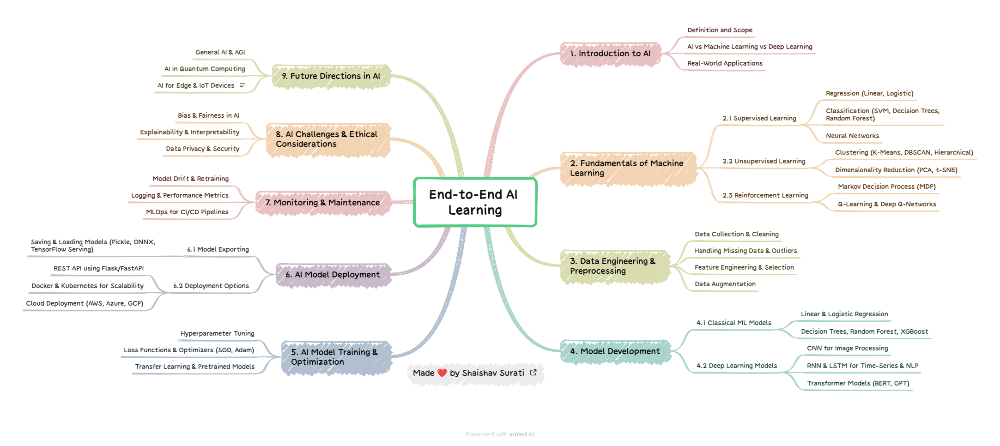

# 🚀 End-to-End AI Learning

## 📌 Table of Contents

1. 📖 [Introduction to AI](docs/Introduction_to_AI.md)
2. 🤖 [Fundamentals of Machine Learning](docs/Supervised_Learning.md)
   - 🔍 [Supervised Learning](docs/Supervised_Learning.md)
   - 📊 [Unsupervised Learning](docs/Unsupervised_Learning.md)
   - 🎮 [Reinforcement Learning](docs/Reinforcement_Learning.md)
3. 🏗️ [Data Engineering & Preprocessing](docs/Data_Engineering.md)
4. 🏛️ [Model Development](docs/Model_Development.md)
   - 📏 [Classical ML Models](docs/Classical_ML.md)
   - 🧠 [Deep Learning Models](docs/Deep_Learning.md)
5. 🎯 [AI Model Training & Optimization](docs/Model_Training.md)
6. 🚀 [AI Model Deployment](docs/Model_Deployment.md)
   - 💾 [Model Exporting](docs/Model_Exporting.md)
   - ☁️ [Deployment Options](docs/Deployment_Options.md)
7. 🛠️ [Monitoring & Maintenance](docs/Monitoring_Maintenance.md)
8. ⚖️ [AI Challenges & Ethical Considerations](docs/AI_Ethics.md)
9. 🔮 [Future Directions in AI](docs/Future_AI.md)

---

## 🧠 1. Introduction to AI
### 📌 Definition and Scope
Artificial Intelligence (AI) is a branch of computer science focused on creating systems capable of performing tasks that typically require human intelligence. These tasks include speech recognition, decision-making, and problem-solving.

### 🤔 AI vs Machine Learning vs Deep Learning
- **AI**: Broad field encompassing all intelligent machine behavior.
- **Machine Learning (ML)**: A subset of AI that enables systems to learn from data.
- **Deep Learning**: A further subset of ML using neural networks to learn patterns.

### 🌍 Real-World Applications
- 🚗 Autonomous Vehicles
- 🗣️ Natural Language Processing (Chatbots, Translation)
- 🏥 Medical Diagnosis
- 🔍 Fraud Detection

📖 [Read More](docs/Introduction_to_AI.md)

---

## 🤖 2. Fundamentals of Machine Learning
### 🎯 2.1 Supervised Learning
- 📈 Regression (Linear, Logistic)
- 🏷️ Classification (SVM, Decision Trees, Random Forest)
- 🧠 Neural Networks

📖 [Read More](docs/Supervised_Learning.md)

### 🔍 2.2 Unsupervised Learning
- 📊 Clustering (K-Means, DBSCAN, Hierarchical)
- 🎭 Dimensionality Reduction (PCA, t-SNE)

📖 [Read More](docs/Unsupervised_Learning.md)

### 🎮 2.3 Reinforcement Learning
- ♟️ Markov Decision Process (MDP)
- 🏆 Q-Learning & Deep Q-Networks

📖 [Read More](docs/Reinforcement_Learning.md)

---

## 🏗️ 3. Data Engineering & Preprocessing
- 📥 Data Collection & Cleaning
- 🔍 Handling Missing Data & Outliers
- 🎨 Feature Engineering & Selection
- 📦 Data Augmentation

📖 [Read More](docs/Data_Engineering.md)

---

## 🏛️ 4. Model Development
### 📏 4.1 Classical ML Models
- 📊 Linear & Logistic Regression
- 🌲 Decision Trees, Random Forest, XGBoost

📖 [Read More](docs/Classical_ML.md)

### 🧠 4.2 Deep Learning Models
- 🖼️ CNN for Image Processing
- ⏳ RNN & LSTM for Time-Series & NLP
- 🤖 Transformer Models (BERT, GPT)

📖 [Read More](docs/Deep_Learning.md)

---

## 🎯 5. AI Model Training & Optimization
- 🎛️ Hyperparameter Tuning
- 📉 Loss Functions & Optimizers (SGD, Adam)
- 🚀 Transfer Learning & Pretrained Models

📖 [Read More](docs/Model_Training.md)

---

## 🚀 6. AI Model Deployment
### 💾 6.1 Model Exporting
- 📥 Saving & Loading Models (Pickle, ONNX, TensorFlow Serving)

📖 [Read More](docs/Model_Exporting.md)

### ☁️ 6.2 Deployment Options
- 🌍 REST API using Flask/FastAPI
- 📦 Docker & Kubernetes for Scalability
- ☁️ Cloud Deployment (AWS, Azure, GCP)

📖 [Read More](docs/Deployment_Options.md)

---

## 🛠️ 7. Monitoring & Maintenance
- 🔄 Model Drift & Retraining
- 📊 Logging & Performance Metrics
- 🚀 MLOps for CI/CD Pipelines

📖 [Read More](docs/Monitoring_Maintenance.md)

---

## ⚖️ 8. AI Challenges & Ethical Considerations
- 🏳️‍⚖️ Bias & Fairness in AI
- 🔎 Explainability & Interpretability
- 🔐 Data Privacy & Security

📖 [Read More](docs/AI_Ethics.md)

---

## 🔮 9. Future Directions in AI
- 🧠 General AI & AGI
- ⚛️ AI in Quantum Computing
- 📡 AI for Edge & IoT Devices

📖 [Read More](docs/Future_AI.md)

---

### 🤝 **Connect with Me:**
- 🔗 **LinkedIn**: [Shaishav Surati 🇮🇳](https://www.linkedin.com/in/shaishavsurati)
- 🏗️ **GitHub**: [shaishav06](https://github.com/shaishav06)
- 📧 **Email**: [shaishavsurati06@gmail.com](mailto:shaishavsurati06@gmail.com)

---

### ❤️ Made with Passion by Shaishav Surati 🚀