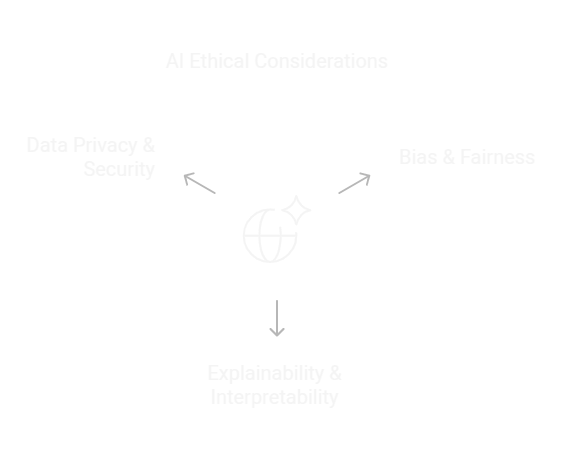

# ⚖️ AI Challenges & Ethical Considerations
---

As **AI systems** become more integrated into everyday life, addressing **ethical concerns** such as **bias, fairness, explainability, and data privacy** is crucial. This guide covers **Bias & Fairness in AI, Explainability & Interpretability, and Data Privacy & Security** with practical examples. 🛡️



---

## ⚠️ 1. Bias & Fairness in AI
Bias in AI occurs when a model systematically **favors or disadvantages** a particular group due to **biased training data** or **algorithmic decisions**. 🚨

### 📊 1.1 Types of Bias in AI
- **📉 Data Bias**: Training data lacks diversity (e.g., facial recognition failing for certain ethnic groups).
- **⚙️ Algorithmic Bias**: The model learns patterns that reinforce unfair outcomes.
- **🎯 Selection Bias**: Sample data is not representative of the real-world population.

### 🔍 1.2 Detecting Bias in AI
**Example: Checking Gender Bias in Hiring Models** 🏢
```python
import pandas as pd
from sklearn.linear_model import LogisticRegression
from sklearn.metrics import accuracy_score

# Sample biased dataset
data = {'Experience': [1, 5, 10, 2, 8, 3], 'Gender': [0, 1, 1, 0, 1, 0], 'Hired': [0, 1, 1, 0, 1, 0]}
df = pd.DataFrame(data)

# Train model
X, y = df[['Experience', 'Gender']], df['Hired']
model = LogisticRegression()
model.fit(X, y)

# Test fairness by removing gender feature
X_fair = df[['Experience']]
predictions = model.predict(X_fair)
print("✅ Accuracy without Gender Bias:", accuracy_score(y, predictions))
```
### 🛠️ 1.3 Mitigating Bias
✔️ **Balanced Datasets**: Ensure diverse and representative data.  
✔️ **Bias-Aware Algorithms**: Use debiasing techniques like re-weighting.  
✔️ **Fairness Metrics**: Apply fairness evaluation tools such as `AI Fairness 360`.  

**Example: Removing Bias using AI Fairness 360** 🤖
```python
from aif360.algorithms.preprocessing import Reweighing
from aif360.datasets import BinaryLabelDataset

# Load dataset
dataset = BinaryLabelDataset(df=df, label_names=['Hired'], protected_attribute_names=['Gender'])

# Apply reweighing technique
reweighing = Reweighing()
dataset_transformed = reweighing.fit_transform(dataset)
```

---

## 🧐 2. Explainability & Interpretability
Explainability ensures that AI model **decisions are transparent and interpretable**, helping stakeholders understand why a model made a certain prediction. 🏛️

### 🔎 2.1 Techniques for Explainability
- 📊 **Feature Importance**: Identifying the most influential input features.
- 🧠 **LIME (Local Interpretable Model-agnostic Explanations)**: Explains individual predictions.
- 🌟 **SHAP (Shapley Additive Explanations)**: Measures the impact of each feature.

### 📢 2.2 Example: Using SHAP for Explainability
```python
import shap
import xgboost as xgb
from sklearn.datasets import load_boston

# Load dataset
boston = load_boston()
X, y = boston.data, boston.target

# Train model
model = xgb.XGBRegressor()
model.fit(X, y)

# Explain predictions
explainer = shap.Explainer(model)
shap_values = explainer(X)
shap.summary_plot(shap_values, X)
```

---

## 🔐 3. Data Privacy & Security
AI models often process **sensitive user data**, making **privacy and security** critical. 🛡️

### ⚠️ 3.1 Challenges in Data Privacy
- 🔓 **Data Leakage**: Model memorizes and exposes sensitive data.
- 🕵️ **Unauthorized Access**: Attackers may steal training data.
- 🔍 **Re-Identification**: Anonymized data can sometimes be traced back to individuals.

### 🔒 3.2 Secure AI Practices
✔️ **Data Anonymization**: Remove personally identifiable information (PII).  
✔️ **Federated Learning**: Train models without sharing raw data.  
✔️ **Differential Privacy**: Add controlled noise to prevent identification.  

### 🛡️ 3.3 Example: Implementing Differential Privacy with PySyft
```python
import torch
import syft as sy

# Create a secure data tensor
hook = sy.TorchHook(torch)
x = torch.tensor([1.0, 2.0, 3.0, 4.0])
secure_x = x + torch.randn_like(x) * 0.1  # Adding noise for differential privacy
print("🔐 Secure Data:", secure_x)
```

---

## 🎯 Conclusion
✅ **Bias & Fairness**: Identify and mitigate bias to ensure ethical AI decisions.  
✅ **Explainability**: Use techniques like SHAP and LIME to interpret AI predictions.  
✅ **Data Privacy**: Implement security measures to protect sensitive user data.  

Ethical **AI practices ensure that AI systems are trustworthy, fair, and secure**. 🔍🛡️

📖 **[Back to Main README](../README.md)**
