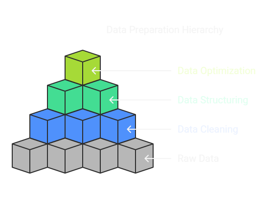

# ⚙️ Data Engineering & Preprocessing

Data engineering is a crucial step in AI and machine learning, involving the preparation of raw data to ensure high-quality, structured, and optimized input for models. 🚀


---

## 🏗️ 1. Data Collection & Cleaning
Data collection involves gathering data from various sources, while cleaning ensures that the data is usable.

### 📥 1.1 Data Collection Sources
- 🌐 **APIs**: Collecting real-time data from web services.
- 🗄️ **Databases**: SQL, NoSQL, and cloud-based data storage.
- 🕷 **Web Scraping**: Extracting data from websites using libraries like `BeautifulSoup` and `Scrapy`.
- 📡 **Sensor Data**: IoT devices and real-time monitoring.

**Example: Web Scraping with BeautifulSoup** 📰
```python
import requests
from bs4 import BeautifulSoup

url = "https://example.com/news"
response = requests.get(url)
soup = BeautifulSoup(response.text, "html.parser")
articles = soup.find_all("h2")
for article in articles:
    print(article.text)
```

### 🧹 1.2 Data Cleaning
Cleaning involves handling inconsistent, incomplete, and duplicate data.

**Steps:**
✅ Remove duplicates  
✅ Handle missing values  
✅ Standardize formatting  
✅ Remove irrelevant data  

**Example: Cleaning a Pandas DataFrame** 🗂️
```python
import pandas as pd

data = {'Name': ['Alice', 'Bob', 'Charlie', None], 'Age': [25, None, 30, 22]}
df = pd.DataFrame(data)

# Handle missing values
df.fillna({'Name': 'Unknown', 'Age': df['Age'].mean()}, inplace=True)
print(df)
```

---

## ⚠️ 2. Handling Missing Data & Outliers

### 🔍 2.1 Handling Missing Data
Missing data can be handled using:
- 📊 **Mean/Median/Mode Imputation**
- ⏩ **Forward/Backward Fill**
- 🗑 **Dropping Missing Values**

**Example: Using Mean Imputation**
```python
df['Age'].fillna(df['Age'].mean(), inplace=True)
```

### 🚨 2.2 Handling Outliers
Outliers can be detected and removed using:
- 📏 **Z-score Method**
- 📈 **Interquartile Range (IQR)**
- 🔄 **Winsorization**

**Example: Detecting Outliers with IQR**
```python
Q1 = df['Age'].quantile(0.25)
Q3 = df['Age'].quantile(0.75)
IQR = Q3 - Q1
outliers = df[(df['Age'] < (Q1 - 1.5 * IQR)) | (df['Age'] > (Q3 + 1.5 * IQR))]
print("Outliers:", outliers)
```

---

## 🔬 3. Feature Engineering & Selection
Feature engineering creates meaningful features, while feature selection chooses the most relevant ones.

### 🎨 3.1 Feature Engineering
- 🔢 **Encoding Categorical Data** (One-Hot Encoding, Label Encoding)
- 📆 **Date/Time Features** (Extracting Day, Month, Year, etc.)
- 🛠️ **Domain-Specific Features** (Custom transformations)

**Example: One-Hot Encoding** 🎭
```python
from sklearn.preprocessing import OneHotEncoder
import numpy as np

X = np.array([['Red'], ['Blue'], ['Green']])
encoder = OneHotEncoder(sparse=False)
encoded_X = encoder.fit_transform(X)
print(encoded_X)
```

### 🎯 3.2 Feature Selection
- 🎚 **Filter Methods** (Correlation, Chi-Square Test)
- 🔍 **Wrapper Methods** (Recursive Feature Elimination)
- 🌳 **Embedded Methods** (Lasso, Decision Trees)

**Example: Feature Selection using Lasso** 🎯
```python
from sklearn.linear_model import Lasso
from sklearn.datasets import load_boston

boston = load_boston()
X, y = boston.data, boston.target
model = Lasso(alpha=0.1)
model.fit(X, y)
print("Selected Features:", model.coef_)
```

---

## 📈 4. Data Augmentation
Data augmentation artificially increases the training dataset using transformations.

### 🖼️ 4.1 Image Augmentation
```python
from tensorflow.keras.preprocessing.image import ImageDataGenerator

datagen = ImageDataGenerator(rotation_range=40, width_shift_range=0.2, height_shift_range=0.2, zoom_range=0.2)
```

### 📝 4.2 Text Data Augmentation
```python
from nlpaug.augmenter.word import SynonymAug
aug = SynonymAug()
text = "AI is transforming the world."
print(aug.augment(text))
```

---

## 🔄 5. Building a Data Engineering Pipeline
A data engineering pipeline automates the flow of data from collection to preprocessing.

### 🛠 Steps:
1️⃣ Data Ingestion  
2️⃣ Data Cleaning & Transformation  
3️⃣ Feature Engineering  
4️⃣ Data Storage  
5️⃣ Data Serving  

**Example: End-to-End Pipeline using Pandas** 🔗
```python
def load_data():
    return pd.read_csv("data.csv")

def clean_data(df):
    df.drop_duplicates(inplace=True)
    df.fillna(df.mean(), inplace=True)
    return df

def transform_data(df):
    df['NewFeature'] = df['Age'] * 2  # Example feature engineering
    return df

def save_data(df):
    df.to_csv("processed_data.csv", index=False)

df = load_data()
df = clean_data(df)
df = transform_data(df)
save_data(df)
print("✅ Pipeline executed successfully!")
```

---

## 🏆 Conclusion
Data engineering is a crucial step in AI, ensuring that raw data is transformed into a structured format suitable for machine learning models. A well-designed data pipeline automates this process, improving efficiency and reproducibility. 🔥

📖 **[Back to Main README](../README.md)**
