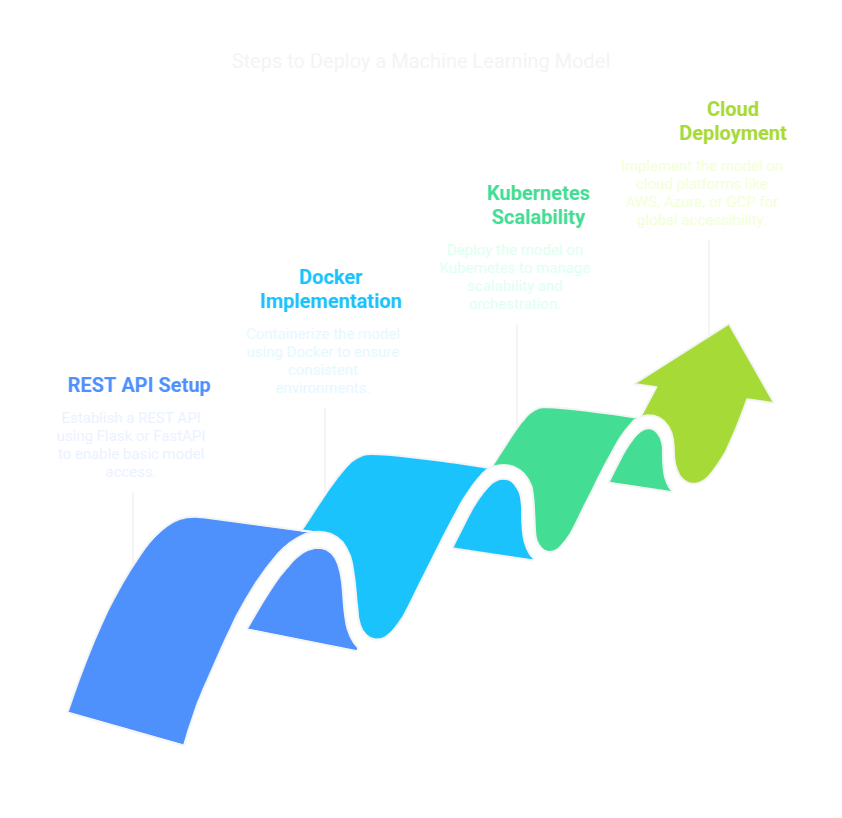

# 🚀 Deployment Options

Deploying a **machine learning model** enables it to be used by applications and services. This guide covers different deployment methods, including **REST APIs using Flask/FastAPI, Docker & Kubernetes for scalability, and cloud deployment (AWS, Azure, GCP).** 🌎



---

## 🌐 1. REST API using Flask/FastAPI
Creating a **REST API** allows applications to send input data and receive predictions from the model.

### 🛠 1.1 Deploying a Model with Flask
**Example: Deploying a Scikit-Learn Model with Flask** 🏗️
```python
import pickle
from flask import Flask, request, jsonify

# Load trained model
with open("model.pkl", "rb") as file:
    model = pickle.load(file)

# Initialize Flask app
app = Flask(__name__)

@app.route('/predict', methods=['POST'])
def predict():
    data = request.get_json()
    prediction = model.predict([data['features']])
    return jsonify({'prediction': prediction.tolist()})

if __name__ == '__main__':
    app.run(debug=True)
```
**Run the Flask App:** 🚀
```bash
python app.py
```
**Test API with cURL:** 🔍
```bash
curl -X POST http://127.0.0.1:5000/predict -H "Content-Type: application/json" -d '{"features": [3, 4]}'
```

---

### ⚡ 1.2 Deploying a Model with FastAPI
**FastAPI** is a modern, high-performance framework for building APIs with Python.

**Example: Deploying a Model with FastAPI** 🚀
```python
from fastapi import FastAPI
import pickle

# Load trained model
with open("model.pkl", "rb") as file:
    model = pickle.load(file)

app = FastAPI()

@app.post("/predict")
def predict(features: list):
    prediction = model.predict([features])
    return {"prediction": prediction.tolist()}

if __name__ == "__main__":
    import uvicorn
    uvicorn.run(app, host="0.0.0.0", port=8000)
```
**Run the FastAPI App:** 🏎️
```bash
uvicorn app:app --reload
```

---

## 🐳 2. Docker & Kubernetes for Scalability

### 📦 2.1 Deploying with Docker
Docker allows packaging the model and API into a **portable container**.

**Create a `Dockerfile`:**
```dockerfile
FROM python:3.8
WORKDIR /app
COPY requirements.txt ./
RUN pip install --no-cache-dir -r requirements.txt
COPY . .
CMD ["python", "app.py"]
```
**Build and Run the Docker Container:** 🛠️
```bash
docker build -t ml_model .
docker run -p 5000:5000 ml_model
```

### ☁️ 2.2 Deploying with Kubernetes
Kubernetes manages **containerized applications** at scale. 📈

**Example: Kubernetes Deployment YAML** 🗄️
```yaml
apiVersion: apps/v1
kind: Deployment
metadata:
  name: ml-model
spec:
  replicas: 2
  selector:
    matchLabels:
      app: ml-model
  template:
    metadata:
      labels:
        app: ml-model
    spec:
      containers:
      - name: ml-model
        image: ml_model:latest
        ports:
        - containerPort: 5000
```
**Deploy to Kubernetes:** ⚡
```bash
kubectl apply -f deployment.yaml
```

---

## ☁️ 3. Cloud Deployment (AWS, Azure, GCP)

### 🌍 3.1 Deploying on AWS Lambda
AWS Lambda allows deploying models as **serverless functions**.

**Steps:**
1️⃣ Package the model and dependencies.  
2️⃣ Upload the package to **AWS Lambda**.  
3️⃣ Create an **API Gateway endpoint**.  

### 🔷 3.2 Deploying on Azure Machine Learning
Azure ML allows deploying models as **web services**.

**Steps:**
1️⃣ Register the model in **Azure ML workspace**.  
2️⃣ Deploy the model using **Azure Kubernetes Service (AKS)**.  
3️⃣ Expose a **REST endpoint**.  

### 🔴 3.3 Deploying on Google Cloud Platform (GCP)
GCP offers **AI Platform** for serving models.

**Steps:**
1️⃣ Upload the trained model to **Google Cloud Storage**.  
2️⃣ Deploy using **AI Platform Prediction**.  
3️⃣ Get predictions using **REST API**.  

**Example: Deploying a Model on GCP AI Platform** 🌟
```bash
gcloud ai models create --region=us-central1 --display-name=my_model
```

---

## 🎯 Conclusion
✔️ **Flask & FastAPI** provide **simple REST APIs** for model deployment.  
✔️ **Docker & Kubernetes** ensure **scalability** for large applications.  
✔️ **Cloud Platforms (AWS, Azure, GCP)** offer **enterprise-grade deployment options**.  

Choosing the right **deployment method** depends on **performance, scalability, and infrastructure needs**. 🌍🚀

📖 **[Back to Main README](../README.md)**
