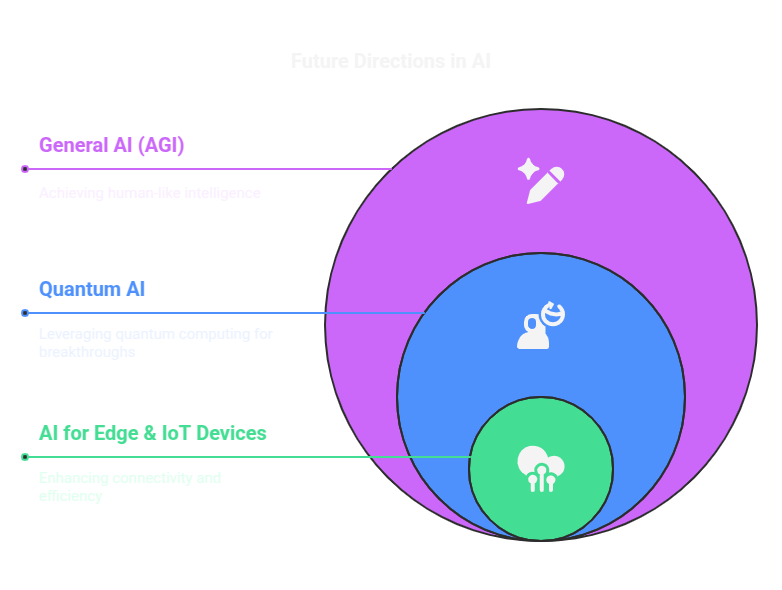

# 🚀 Future Directions in AI

The future of AI is evolving rapidly, with advancements in **General AI (AGI), Quantum AI, and AI for Edge & IoT Devices**. This guide explores these emerging areas and their potential impact. 🌍🤖



---

## 🧠 1. General AI & Artificial General Intelligence (AGI)

### 🔍 1.1 What is AGI?
**Artificial General Intelligence (AGI)** refers to AI systems capable of performing **any intellectual task** that a human can do. Unlike **Narrow AI**, which is specialized for specific tasks (e.g., image recognition, chatbots), AGI aims to achieve **human-like reasoning, problem-solving, and learning** across multiple domains.

### ⚠️ 1.2 Challenges in AGI Development
- 🧩 **Common Sense Reasoning**: Machines struggle with abstract and intuitive understanding.
- 🔄 **Transfer Learning**: AGI should adapt skills learned from one domain to another.
- 🤖 **Self-Learning**: Unlike deep learning, AGI must continuously learn without predefined labels.

### 🎮 1.3 Example: AGI using Reinforcement Learning
```python
import gym
import numpy as np

# Initialize OpenAI Gym environment
env = gym.make("CartPole-v1")

# Simple random agent
for episode in range(5):
    state = env.reset()
    done = False
    while not done:
        action = env.action_space.sample()  # Random action
        state, reward, done, _ = env.step(action)
        env.render()

env.close()
```

---

## ⚛️ 2. AI in Quantum Computing

### 🧑‍🔬 2.1 What is Quantum AI?
**Quantum AI** combines quantum computing principles with machine learning algorithms to solve **complex problems exponentially faster** than classical computing. 💡

### ⚡ 2.2 Applications of Quantum AI
- 🚦 **Optimization Problems**: Traffic routing, supply chain logistics.
- 💊 **Drug Discovery**: Simulating molecular structures for new drugs.
- 🔐 **Cryptography**: Quantum-resistant encryption techniques.

### 🔬 2.3 Example: Quantum Machine Learning with Qiskit
```python
from qiskit import QuantumCircuit, Aer, transpile, assemble, execute

# Create a simple quantum circuit
qc = QuantumCircuit(2)
qc.h(0)  # Apply Hadamard gate
qc.cx(0, 1)  # Apply CNOT gate
qc.measure_all()

# Simulate circuit
simulator = Aer.get_backend("qasm_simulator")
job = execute(qc, simulator, shots=1000)
result = job.result()
print(result.get_counts())
```

---

## 🌐 3. AI for Edge & IoT Devices

### 📡 3.1 What is Edge AI?
**Edge AI** refers to deploying AI models on **edge devices** (IoT devices, smartphones, drones) instead of relying on cloud computing. This **reduces latency** and enhances **real-time decision-making**. ⏳

### ⚙️ 3.2 Benefits of Edge AI
- ⚡ **Low Latency**: AI processes data locally without sending it to the cloud.
- 🔋 **Energy Efficiency**: Optimized AI models consume less power.
- 🔒 **Privacy**: Sensitive data remains on the device, reducing security risks.

### 🤖 3.3 Example: Running AI on an Edge Device (Raspberry Pi)
```python
from tensorflow.keras.models import load_model
import cv2
import numpy as np

# Load pre-trained AI model
model = load_model("edge_ai_model.h5")

# Capture image from Raspberry Pi camera
cap = cv2.VideoCapture(0)
ret, frame = cap.read()
cap.release()

# Preprocess image
frame = cv2.resize(frame, (224, 224))
frame = np.expand_dims(frame, axis=0) / 255.0

# Run inference
prediction = model.predict(frame)
print("🔍 Prediction:", prediction)
```

---

## 🎯 Conclusion
✅ **AGI** aims to create **human-level intelligence** with self-learning abilities.  
✅ **Quantum AI** leverages **quantum computing** for faster AI solutions.  
✅ **Edge AI** enables **real-time, low-latency AI** on IoT devices.  

These advancements will **revolutionize industries**, making AI more **intelligent, efficient, and accessible**. 🚀🌍

📖 **[Back to Main README](../README.md)**
