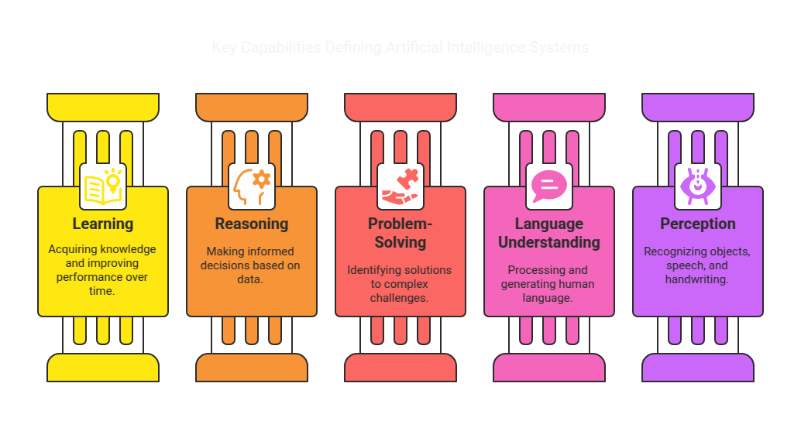
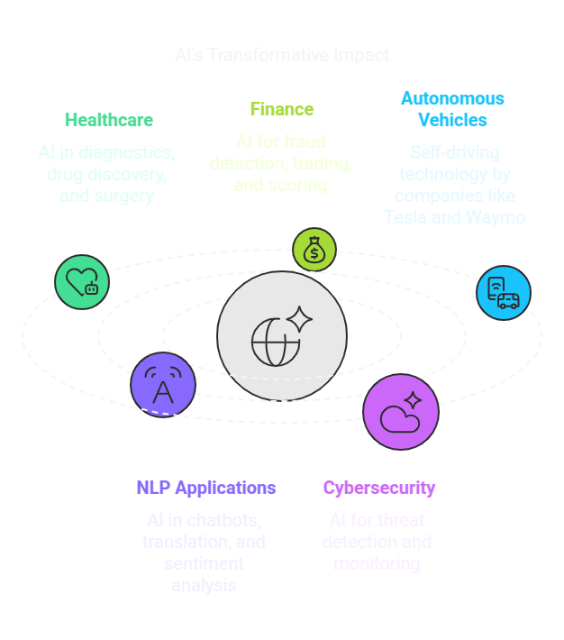

# 🤖 Introduction to AI

## 1️⃣ What is Artificial Intelligence (AI)?
Artificial Intelligence (AI) is a branch of computer science focused on building systems capable of performing tasks that typically require human intelligence. These tasks include:

- 🧠 **Learning**: Acquiring knowledge and improving performance over time.
- 🔎 **Reasoning**: Making informed decisions based on data.
- 🏆 **Problem-Solving**: Identifying solutions to complex challenges.
- 🗣️ **Understanding Language**: Processing and generating human language (NLP).
- 👀 **Perception**: Recognizing objects, speech, and handwriting.

---

## 2️⃣ AI vs Machine Learning vs Deep Learning
### 🏛 2.1 Artificial Intelligence (AI)
AI is the overarching concept that involves creating machines capable of intelligent behavior. It encompasses all approaches that enable computers to perform human-like cognitive tasks.

### 📊 2.2 Machine Learning (ML)
Machine Learning is a subset of AI that enables computers to learn from data and improve their performance without explicit programming. It includes:
- ✅ **Supervised Learning**: Learning from labeled data.
- 🔍 **Unsupervised Learning**: Finding patterns in unlabeled data.
- 🎮 **Reinforcement Learning**: Learning through trial and error with rewards.

### 🧠 2.3 Deep Learning (DL)
Deep Learning is a further subset of ML that uses multi-layered neural networks to model complex patterns in large datasets. It powers advancements in **image recognition**, **speech processing**, and **autonomous systems**.

---

## 3️⃣ Types of AI
### 🤖 3.1 Narrow AI (Weak AI)
Narrow AI is designed to perform a single task efficiently, such as:
- 🗣 **Voice Assistants** (Siri, Alexa, Google Assistant)
- 🎬 **Recommendation Systems** (Netflix, YouTube, Amazon)
- 💬 **Chatbots** (Customer Service AI)

### 🏆 3.2 General AI (Strong AI)
General AI aims to develop systems that possess human-like intelligence, allowing them to perform any cognitive task as effectively as a person. This remains **theoretical** at present.

### 🚀 3.3 Artificial Superintelligence (ASI)
ASI refers to a **future AI system** that surpasses human intelligence in all domains, leading to autonomous decision-making beyond human capabilities.

---

## 4️⃣ Real-World Applications of AI
AI is transforming multiple industries, including:

- 🏥 **Healthcare**: AI-powered diagnostics, drug discovery, robotic surgery.
- 💰 **Finance**: Fraud detection, algorithmic trading, credit scoring.
- 🚗 **Autonomous Vehicles**: Self-driving cars (Tesla, Waymo).
- 🗣️ **NLP Applications**: Chatbots, translation, sentiment analysis.
- 🔒 **Cybersecurity**: Threat detection, automated monitoring.

---

## 5️⃣ Ethical Considerations in AI ⚖️
As AI advances, ethical concerns arise:
- ⚠️ **Bias in AI Models**: Ensuring fairness in decision-making.
- 🔍 **Explainability**: Making AI decisions transparent and interpretable.
- 🔐 **Privacy & Security**: Protecting user data.
- 💼 **Job Displacement**: The impact of automation on employment.

---

## 6️⃣ Future of AI 🔮
AI continues to evolve, with exciting future developments:
- ⚛️ **AI & Quantum Computing**: Solving complex problems beyond classical computing.
- 🌍 **AI for Edge Computing**: Running AI models on low-power devices (IoT).
- 🤖 **Autonomous AI Agents**: Fully independent decision-making systems.

---
### 🔙 [Back to Main README](../README.md)
