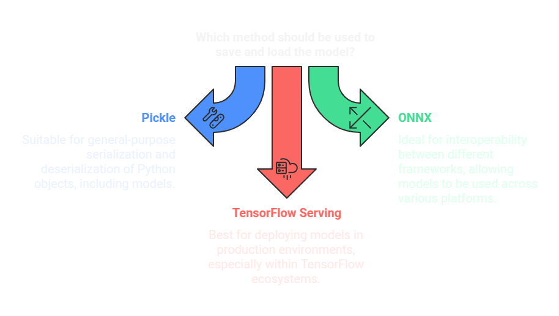

# 📦 Model Exporting: Saving & Loading Models

Once a **machine learning model** is trained, it is essential to **save** it for future use, deployment, or further fine-tuning. This guide covers different methods of saving and loading models using **Pickle, ONNX, and TensorFlow Serving**. 🚀



---

## 📝 1. Saving & Loading Models using Pickle
**Pickle** is a Python module used for **serializing and deserializing** objects, including trained ML models.

### 💾 1.1 Saving a Model with Pickle
```python
import pickle
from sklearn.linear_model import LogisticRegression
import numpy as np

# Sample training data
X = np.array([[1, 2], [2, 3], [3, 4], [4, 5]])
y = np.array([0, 0, 1, 1])

# Train model
model = LogisticRegression()
model.fit(X, y)

# Save model to file
with open("model.pkl", "wb") as file:
    pickle.dump(model, file)
print("✅ Model saved successfully!")
```

### 📂 1.2 Loading a Model with Pickle
```python
# Load model from file
with open("model.pkl", "rb") as file:
    loaded_model = pickle.load(file)

# Make predictions
prediction = loaded_model.predict([[3, 4]])
print("🔍 Prediction:", prediction)
```

---

## 🔄 2. Saving & Loading Models using ONNX
**ONNX** (Open Neural Network Exchange) is an open-source format for representing ML models, making them **portable** across different frameworks. 🔗

### 📥 2.1 Installing ONNX and Converting a Scikit-Learn Model
```python
!pip install onnx skl2onnx

import onnx
import skl2onnx
from skl2onnx import convert_sklearn
from skl2onnx.common.data_types import FloatTensorType

# Define the input shape
initial_type = [('float_input', FloatTensorType([None, 2]))]

# Convert and save model
onnx_model = convert_sklearn(model, initial_types=initial_type)
with open("model.onnx", "wb") as file:
    file.write(onnx_model.SerializeToString())
print("✅ Model saved in ONNX format!")
```

### 📤 2.2 Loading an ONNX Model and Running Inference
```python
import onnxruntime as rt
import numpy as np

# Load ONNX model
session = rt.InferenceSession("model.onnx")

# Prepare input data
input_name = session.get_inputs()[0].name
input_data = np.array([[3, 4]], dtype=np.float32)

# Run inference
output = session.run(None, {input_name: input_data})
print("🔍 ONNX Model Prediction:", output)
```

---

## ⚡ 3. Saving & Loading Models using TensorFlow Serving
**TensorFlow Serving** is used to deploy **TensorFlow models** in production environments. 🏭

### 💾 3.1 Saving a TensorFlow Model
```python
import tensorflow as tf
from tensorflow.keras.models import Sequential
from tensorflow.keras.layers import Dense

# Create a simple model
model = Sequential([
    Dense(10, activation='relu', input_shape=(2,)),
    Dense(1, activation='sigmoid')
])

# Compile and save model
model.compile(optimizer='adam', loss='binary_crossentropy')
model.save("saved_model")
print("✅ TensorFlow Model Saved!")
```

### 📂 3.2 Loading a TensorFlow Model
```python
# Load model
loaded_model = tf.keras.models.load_model("saved_model")

# Make predictions
prediction = loaded_model.predict([[3, 4]])
print("🔍 TensorFlow Model Prediction:", prediction)
```

---

## 🎯 Conclusion
✅ **Pickle** is useful for quick **local storage** of models.  
✅ **ONNX** enables **cross-framework model compatibility**.  
✅ **TensorFlow Serving** is ideal for **production-scale deployments**.  

Choosing the right method depends on the **use case, model portability, and deployment requirements**. 🚀

📖 **[Back to Main README](../README.md)**
